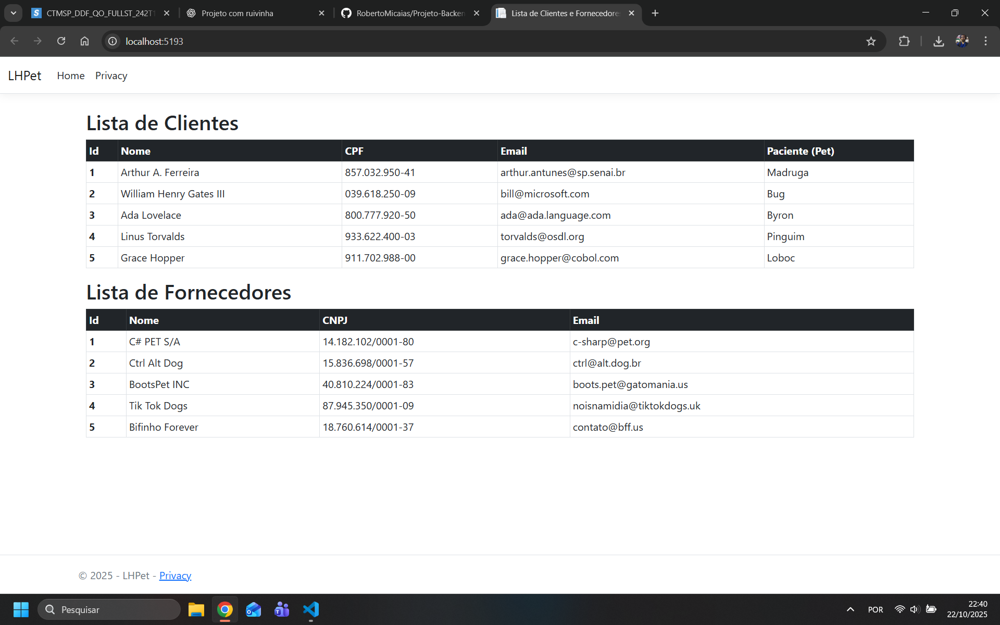

# 🐾 LHPet MVC

Aplicação web desenvolvida em **.NET MVC**, simulando o sistema da clínica veterinária *LH-Pet*.

## 🧩 Funcionalidades
- Cadastro de Clientes e Fornecedores (sem banco de dados)
- Arquitetura MVC
- Views com Bootstrap
- Lógica de negócios no Controller
- Exibição dinâmica com Razor (`ViewBag`)

## 💻 Tecnologias
- ASP.NET Core 8.0
- C#
- HTML + Bootstrap
- Razor View Engine

## 📸 Exemplo de saída

---

Desenvolvido por [Roberto Micaías](https://github.com/robertomiciais) 💻✨
